  

  

Desenvolvedor Full Stack focado em criar **sites e sistemas sob medida** — do planejamento ao deploy — para negócios locais e projetos próprios. Também atuo com **cibersegurança e pentest**.

🎓 Técnico em Informática Avançado pelo Instituto Federal de Educação, Ciência e Tecnologia da Bahia (IFBA) — Campus Euclides da Cunha.

🌐 Portfólio completo: **[eltongarciati.github.io](https://eltongarciati.github.io)**

---

### 🚀 Projetos em produção
- **[Danilo Motos](https://danilomotos.com)** — site oficial para loja de motos
- **[Afiliados Bet](https://afiliadosbet.org)** — landing page de afiliados
- **[Adílio Pizza](https://adiliopizza.com)** — site para pizzaria
- **[VN Palpites](https://vnyuhb.com)** — site de palpites esportivos

### 🛠️ Stack & habilidades

  

`Streamlit` `Deploy em VPS` `GitHub Pages` `Cibersegurança` `Pentest` `Criptografia`

### 📊 Estatísticas

  
  

📚 Grade curricular — Técnico em Informática (IFBA)

 

- Arquitetura de Computadores Subsequente
- Banco de Dados
- Desenho Técnico
- Estrutura de Dados
- Linguagem I – OO com Java
- Sistemas Operacionais
- Análise e Modelagem de Dados
- Desenvolvimento Web I
- Eletrônica Digital Básica
- Linguagem II – C#
- Rede de Computadores I
- Desenvolvimento Web II
- Empreendedorismo
- Gestão de Organizações
- Organização, Normas e Qualidade
- Projeto Integrador
- Rede de Computadores II
- Segurança, Meio Ambiente e Saúde Sub. Informática
- Física Aplicada
- Inglês Técnico
- Produção Textual e Normas Técnicas

### 📫 Contato

